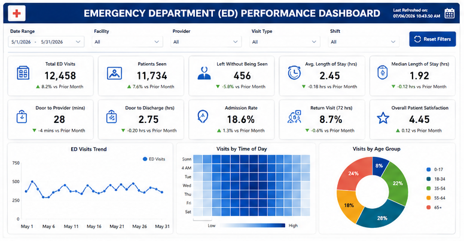
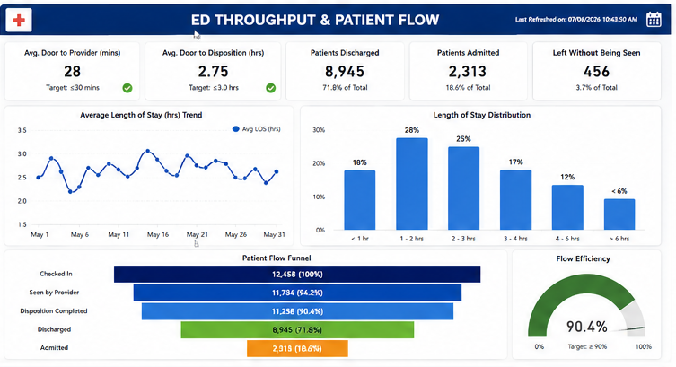
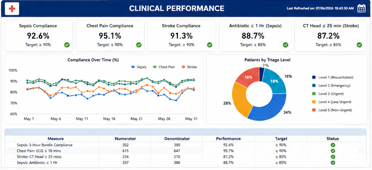
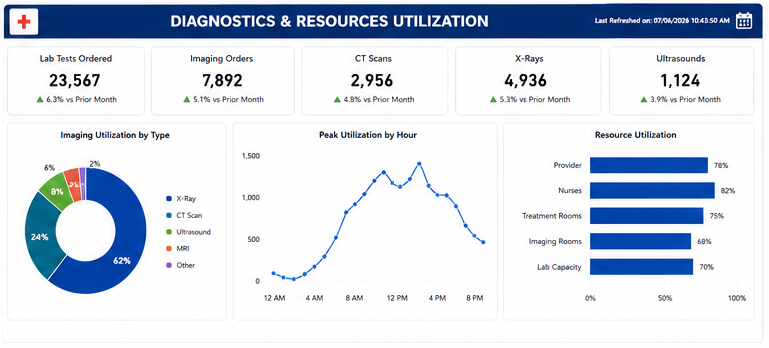
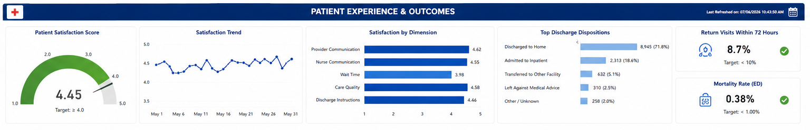

# 🚑 Enterprise Emergency Department Dashboard

### Real-Time Emergency Department Performance | Clinical Quality | Patient Flow | Executive Analytics


---

# 📌 Overview

Emergency Departments operate in one of the most dynamic and time-critical environments in healthcare. Hospital executives require timely access to operational, clinical, and patient experience metrics to optimize patient care, improve throughput, reduce wait times, and ensure regulatory compliance.

The **Enterprise Emergency Department Dashboard** is an executive reporting solution built with **Power BI**, **SQL Server**, and **DAX**. It consolidates multiple operational data sources into a unified analytics platform that enables healthcare leaders to monitor Emergency Department performance in near real time.

This project demonstrates enterprise Business Intelligence practices, including dimensional modeling, KPI engineering, advanced DAX calculations, interactive dashboards, and executive reporting.

---

# 🎯 Business Objectives

The dashboard enables healthcare organizations to:

- Improve Emergency Department efficiency
- Reduce patient wait times
- Monitor patient throughput
- Track clinical quality measures
- Optimize resource utilization
- Improve patient satisfaction
- Monitor provider performance
- Support executive decision making
- Reduce manual reporting effort


---
# 📸 Dashboard Gallery

### Executive Overview Dashboard

<p align="center">
  
</p>

---

### Patient Flow & Throughput Dashboard

<p align="center">
  
</p>

---

### Clinical Quality & Patient Safety Dashboard

<p align="center">
  
</p>

---

### Operations & Resource Utilization Dashboard

<p align="center">
  
</p>

---

### Patient Experience & Outcomes Dashboard

<p align="center">
  
</p>

---

# 📊 Dashboard Modules

## 🏥 Executive Overview

Provides a comprehensive summary of Emergency Department operations.

### Key KPIs

- Total ED Visits
- Patients Seen
- Admission Rate
- Left Without Being Seen (LWBS)
- Door-to-Provider Time
- Door-to-Disposition Time
- Average Length of Stay
- Return Visits within 72 Hours
- Patient Satisfaction
- Mortality Rate

---

## 🚦 ED Throughput & Patient Flow

Monitors patient movement through the Emergency Department.

### Includes

- Patient Flow Funnel
- Throughput Metrics
- Door-to-Provider Time
- Door-to-Disposition Time
- Discharge Rate
- Admission Rate
- Flow Efficiency
- Length of Stay Distribution

---

## 🩺 Clinical Performance

Tracks compliance with evidence-based clinical quality measures.

### Includes

- Sepsis Bundle Compliance
- Stroke Care Compliance
- Chest Pain Compliance
- Antibiotic Administration Time
- CT Scan Turnaround Time
- Triage Level Distribution
- Clinical Performance Trends

---

## 🧪 Diagnostics & Resource Utilization

Provides visibility into diagnostic demand and operational efficiency.

### Includes

- Laboratory Orders
- CT Scans
- MRI
- X-Ray
- Ultrasound
- Imaging Utilization
- Peak Utilization by Hour
- Resource Capacity
- Staff Utilization

---

## 😊 Patient Experience & Outcomes

Measures patient-centered performance.

### Includes

- Patient Satisfaction Score
- Satisfaction Trends
- Satisfaction by Category
- Discharge Disposition
- Mortality Rate
- Return Visits
- Patient Feedback Metrics

---

# 📈 Executive KPIs

The dashboard contains more than **50 executive KPIs**, including:

### Operational

- Total ED Visits
- Average Daily Visits
- Arrival by Hour
- Peak Volume
- Bed Occupancy
- Boarding Time
- Throughput
- Triage Time

### Patient Flow

- Door-to-Provider
- Door-to-Disposition
- Door-to-Discharge
- Admission Rate
- Discharge Rate
- LWBS
- Flow Efficiency

### Clinical Quality

- Sepsis Compliance
- Stroke Compliance
- Chest Pain Compliance
- Antibiotic Timing
- Imaging Turnaround
- Critical Care Response

### Diagnostics

- Lab Orders
- Imaging Orders
- CT
- MRI
- X-Ray
- Ultrasound

### Resource Utilization

- Provider Utilization
- Nurse Utilization
- Treatment Room Occupancy
- Diagnostic Equipment Usage

### Patient Experience

- Satisfaction Score
- Wait Time Rating
- Provider Communication
- Nurse Communication
- Discharge Instructions
- Overall Experience

---

# 🏗 Solution Architecture

```
Emergency Department Systems
          │
          ▼
     SQL Server Database
          │
          ▼
      Power Query (ETL)
          │
          ▼
    Star Schema Data Model
          │
          ▼
       DAX Measures
          │
          ▼
 Interactive Power BI Dashboard
          │
          ▼
 Executive Decision Support
```

---

# ⚙ Technology Stack

| Category | Technology |
|-----------|------------|
| BI Platform | Power BI Desktop |
| Database | SQL Server |
| Query Language | SQL |
| ETL | Power Query |
| Data Modeling | Star Schema |
| Analytics | DAX |
| Visualization | Power BI |
| Version Control | Git & GitHub |

---

# 📊 Dashboard Features

- Executive KPI Cards
- Interactive Filters
- Drill Through Reports
- Trend Analysis
- Gauge Charts
- Funnel Analysis
- Heat Maps
- Operational Dashboards
- Clinical Dashboards
- Resource Analytics
- Patient Experience Analytics

---

# 💼 Business Value

This solution enables hospitals to:

- Improve patient safety
- Reduce Emergency Department congestion
- Increase operational efficiency
- Improve throughput
- Optimize staffing
- Support quality improvement initiatives
- Enhance executive reporting
- Improve patient satisfaction
- Enable data-driven operational decisions

---

# 🧠 Skills Demonstrated

### Business Intelligence

- Executive Dashboard Design
- KPI Engineering
- Healthcare Reporting
- Interactive Visualizations

### Data Analytics

- Advanced DAX
- Time Intelligence
- Operational Analytics
- Trend Analysis

### Data Engineering

- SQL Development
- ETL
- Data Modeling
- Data Transformation

### Healthcare Analytics

- Emergency Department Operations
- Clinical Quality
- Patient Flow
- Hospital Performance
- Resource Utilization
- Executive Reporting

---

# 📁 Repository Structure

```
Enterprise-Emergency-Department-Dashboard
├── Screenshots/
│   ├── Executive Overview.png
│   ├── Patient Flow.png
│   ├── Clinical Performance.png
│   ├── Diagnostics.png
│   └── Patient Experience.png
├── LICENSE
└── README.md
```

---

# 🚀 Future Enhancements

- Real-Time ED Monitoring
- Predictive Patient Arrival Forecasting
- AI-Assisted Capacity Planning
- Microsoft Fabric Integration
- FHIR & HL7 Connectivity
- Automated Alerts
- Mobile Executive Dashboard
- AI Copilot for Natural Language Queries

---

# 📜 Disclaimer

This repository is intended for portfolio and educational purposes. Any healthcare-related information shown is representative or anonymized and does not contain Protected Health Information (PHI).

---

# 👨‍💻 Author

**Mautik Patel**

Enterprise Data • Analytics • AI • Business Intelligence

Passionate about building enterprise analytics solutions that transform healthcare operations into actionable insights through modern data platforms, AI, and Business Intelligence.

---

### ⭐ If you find this project useful, consider giving it a Star!
